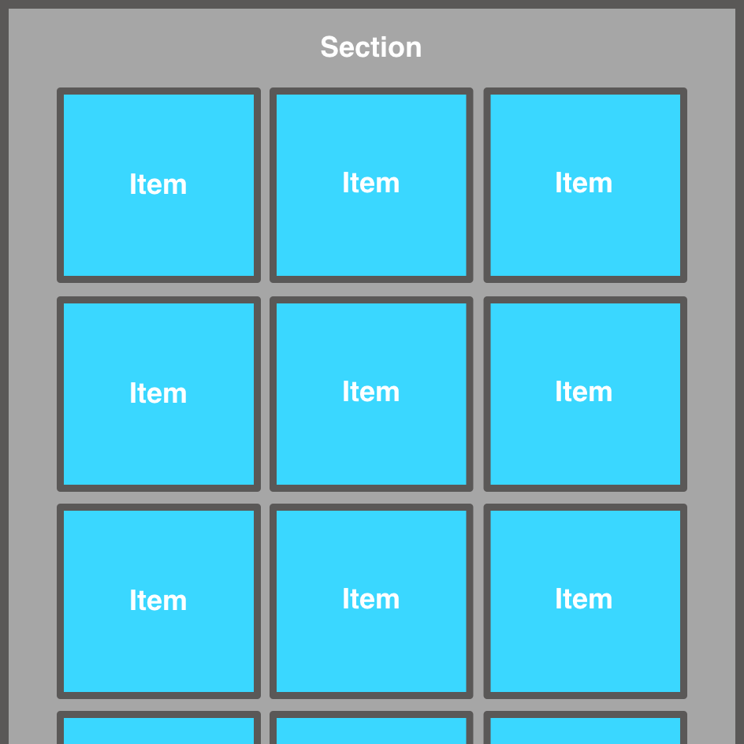
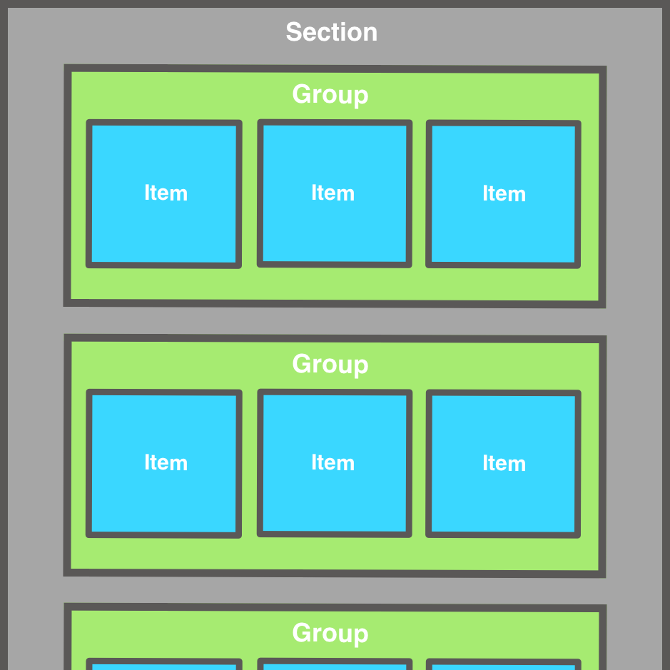

Initial setup: 
- remove Main.storyboard file and its configuration in Info.plist 
- remove SceneDelegate.swift file and its configuration  in Info.plist 
- setup the window with navigationController with a root view controller 

## Using UICollectionViewFlowLayout to build collectionView: 
- create a avaiable UICollectionViewFlowLayout and configure it.
- create a variable UICollectionView using defined flowlayout ealier, assign delegates to self, and register a reusable UICollectionViewCell with unique identifier
- create a class type UICollectionViewCell with a unique static identifier string. Then, calls designated initializer
- create extensions and conform to UICollectionView delegates (UICollectionViewDelegate, UICollectionViewDataSource, UICollectionViewDelegateFlowLayout)
- add collectionview as the subview inside loadView() and setup constraints for it
- back to collectionViewCell, create a UIImageView variable, configure it, make constraints  for it, and  add it as subview to contentView. Then, create a observable variable for binding data  from struct's properties.
- back to UIViewcontroller, create sample data struct. In method  `collectionView(_ collectionView: , cellForItemAt indexPath: )`, bind data for each collection view cell.

**Diagram of a flow layout with items laid out in horizontal lines within a section**

## Using Compositional Layout to build collectioonView: 
- remove outdated FlowLayout logic and methods
- add 4 sections to collection view
- define each section using Compositional Layout
- add category header title for each section
- add background supplementary view for 2 sections

**Diagram of a compositional layout with items nested in groups within a section**

## Build App Center Today scene:
- use table view cell inside another table view cell
- loading local static data for demo 
- parsing data via old method JSONSerialization (need to adopt to the mordern alternative approach)
- TODO: Need to move this approach to tableView project app instead

## Notes: 
- Compositional layout only supports for iOS 13 and above 

- References: 
  + https://www.zealousweb.com/how-to-use-compositional-layout-in-collection-view
  + https://lickability.com/blog/getting-started-with-uicollectionviewcompositionallayout
  + https://github.com/andrei-blaj/appstoreclone

